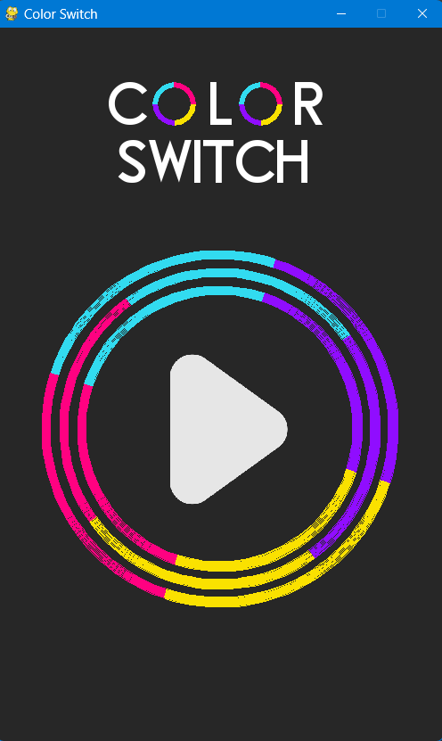
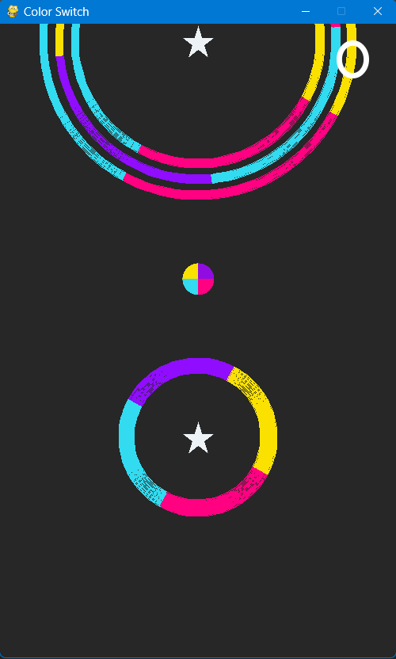
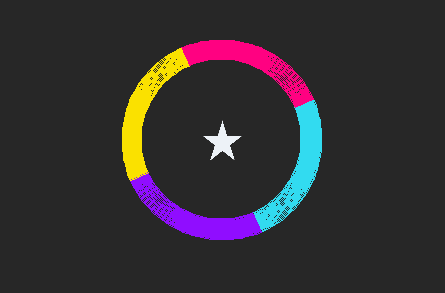
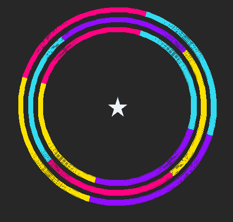
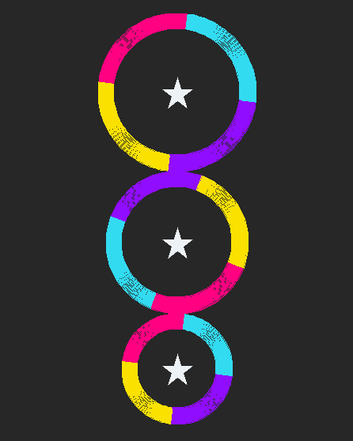
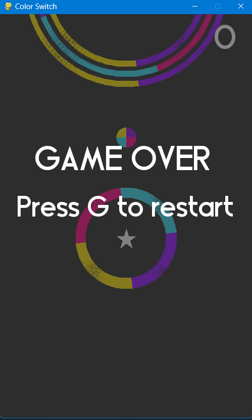

# ColorSwitch-PyGame

This repository contains a Python implementation of the popular mobile game **Color Switch** using the **Pygame** library. The game replicates the core mechanics of the original Color Switch, with exciting features such as rotating obstacles, color-changing power-ups, and collision detection.

---

## Features

- **Opening Screen:** A visually appealing opening screen to start the game.
- **Smooth Gameplay Mechanics:** 
  - Press the `Spacebar` to make the ball move up.
  - Navigate through rotating obstacles made of arcs, built and animated using Pygame's built-in features.
- **Obstacles:**
  - **Rotating Circle:** A circular obstacle with four rotating arcs.
  - **Circle in Circle:** A challenging nested circle obstacle.
  - **Stacking Circles:** A vertical stack of circular arcs.
  - More obstacles will be added in future updates.
- **Color Changer Power-Up:** Randomly changes the ball's color, adding a dynamic twist to the gameplay.
- **Game Over Screen:** A distinct game-over screen to restart or exit the game.
- **Collision Detection:** Accurate detection for ball-obstacle collisions.

---

## How to Play

1. Press the **Spacebar** to make the ball move upwards.
2. Navigate through the obstacles by matching the ball's color with the obstacle's color.
3. Collect the color changer power-up to randomly change the ball's color.
4. Avoid collisions with mismatched colors to survive and score higher!

---

## Controls

| Key        | Action                |
|------------|-----------------------|
| `Spacebar` | Move the ball upward  |

---

## Screenshot Previews

### Opening Screen


### Main Game


### Rotating Circle Obstacle


### Circle in Circle Obstacle


### Stacking Circles Obstacle


### Game Over Screen


## Dependencies

This game is built using the **Pygame** library. Please ensure you have Pygame installed before running the game.


## How to Run

1. Clone or download this repository.
2. Ensure all the **code files** and **assets** (e.g., images, sounds) are in the same folder.
3. Open a terminal in the project folder and run the main game file using Python:

```bash
python main.py

